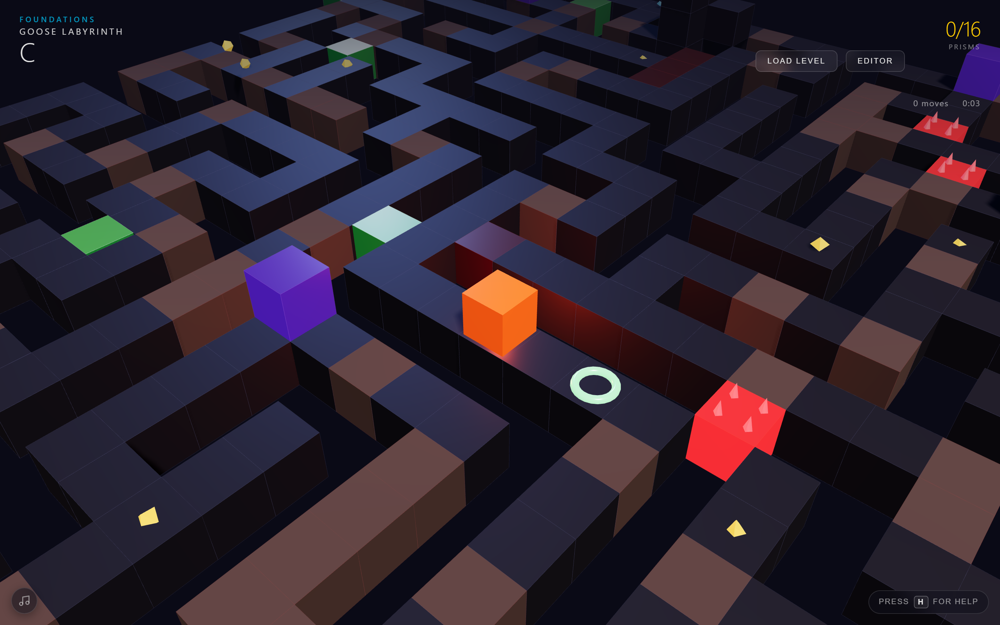
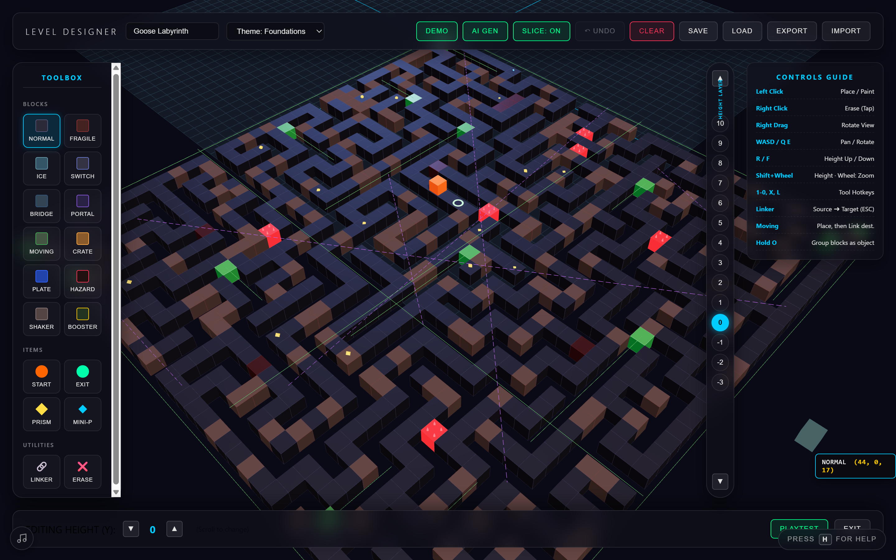
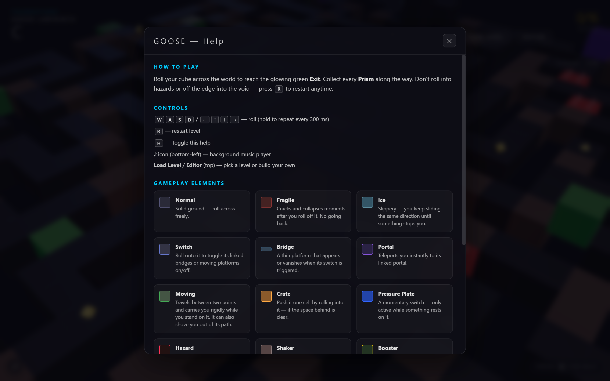
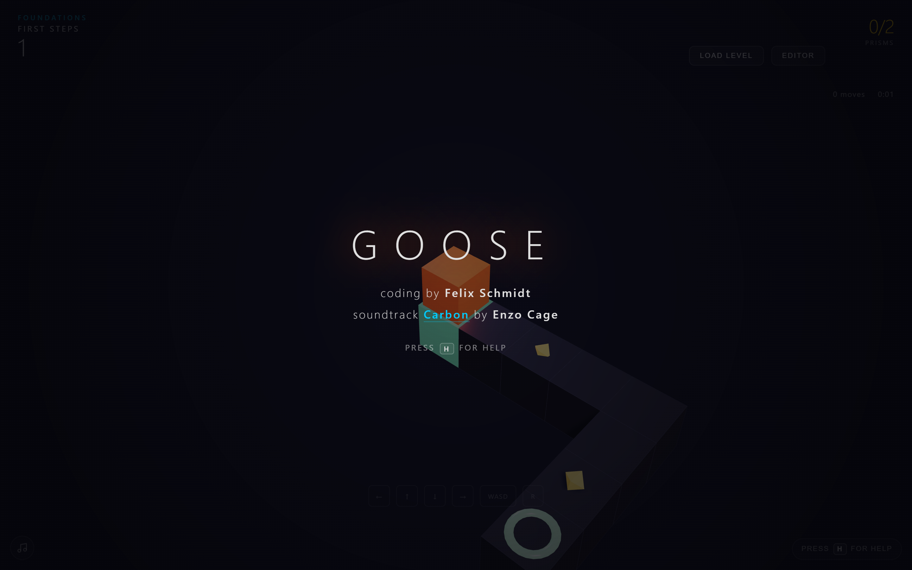

# 🟧 GOOSE — 3D Puzzle-Platformer & Level Editor


Ein immersiver 3D-Puzzle-Platformer im Browser, gebaut mit **Three.js** und einer maßgeschneiderten **generativen Web Audio Synthesizer-Engine**. Steuere deinen Würfel durch komplexe, mehrdimensionale Welten, schrumpfe mit dem Mini-Prisma, um enge Tunnel zu durchqueren, oder baue deine eigenen Level mit dem integrierten Minecraft-ähnlichen 3D-Editor und teile sie.

---

## 📸 Screenshots

### 🎮 Gameplay & Level-Showcase

*Der Spieler rollt als leuchtender Würfel durch das „Goose Labyrinth", sammelt Prismen und weicht Gefahren-, Portal- und Shaker-Blöcken aus.*

### 🛠️ Der 3D Level-Editor

*Der integrierte 3D-Editor mit reichhaltiger Werkzeugpalette (Glassmorphismus-Design), Höhenruler, Layer-Slicing und Controls-Guide.*

### ❓ Hilfe-Overlay

*Das mit `H` aufrufbare Hilfe-Overlay erklärt Steuerung und jedes Gameplay-Element mit Farb-Vorschau, Name und Beschreibung.*

### ✨ Startbildschirm

*Beim Start: kurze Credits-Einblendung mit klickbarem Soundtrack-Link und „press H for help".*

---

## ✨ Features & Gameplay-Mechaniken

### 🎮 Kern-Gameplay & Bewegung
* **Würfel-Rollphysik:** Steuere einen 3D-Würfel, der sich rasterbasiert in vier Richtungen bewegen kann.
* **Klettern & Fallen:** Der Würfel kann automatisch eine einzelne Höhenstufe erklimmen. Fällt er aus zu großer Höhe, verliert er die Balance oder stürzt in den Abgrund.
* **Prismen & Combos:** Sammle Prismen auf dem Spielfeld. Wenn du sie schnell hintereinander einsammelst, aktivierst du einen Punkte-Multiplikator (Combo).
* **Par-System:** Versuche, jedes Level mit möglichst wenigen Spielzügen (Moves) abzuschließen, um die Par-Punktzahl zu schlagen.

### 🧊 Spezialwürfel & Power-ups
* **Normaler Würfel (Standard):** Kann eine Stufe hochklettern und schwere Kisten verschieben. Zu groß für enge Lücken.
* **Mini-Würfel (Mini-Prism Power-up):** Schrumpft den Würfel für eine begrenzte Zeit. 
  * Kann durch **1-Block-hohe Tunnel** kriechen.
  * Kann **beliebig hohe Wände** stufenweise nach oben klettern.
  * Kann *keine* schweren Kisten schieben.

### 🧱 Block-Katalog
Das Spiel verfügt über eine breite Palette interaktiver Blöcke:

| Blocktyp | Symbol | Funktion |
| :--- | :---: | :--- |
| **Normal** | 🟦 | Solider Standard-Boden. |
| **Fragile** | 🟥 | Zerbrechlicher Block. Zerfällt sofort, nachdem der Würfel ihn wieder verlässt. |
| **Ice** | ❄️ | Eisfläche. Lässt den Würfel so lange unaufhaltsam weiterrutschen, bis er an eine Wand oder normalen Boden stößt. |
| **Switch & Bridge** | 🎛️ 🔗 🌉 | Der Schalter aktiviert oder deaktiviert verknüpfte Brücken-Plattformen per Knopfdruck. |
| **Teleporter** | 🌀 | Portale, die paarweise verknüpft sind und den Spieler augenblicklich an einen anderen Ort versetzen. |
| **Moving Platform** | 🟢 | Bewegliche Plattformen, die automatisch zwischen zwei Punkten pendeln und als Fähre dienen. |
| **Crate & Pressure Plate** | 📦 ⚙️ | Schiebe die Kiste auf die Druckplatte, um verknüpfte Brücken dauerhaft offen zu halten. |
| **Danger** | 🔺 | Gefahrenblöcke (Laser/Stacheln). Führen bei Berührung zum sofortigen Reset des Levels. |
| **Shaker** | 📳 | Vibrieren kurz beim Betreten und stürzen nach wenigen Augenblicken in die Tiefe. |
| **Booster** | ⚡ | Beschleunigungspads, die den Würfel blitzschnell über mehrere Felder hinweg katapultieren. |

---

## 🎵 Generative Audio-Engine (Web Audio API)

> [!TIP]
> Schalte den Sound ein! Das Spiel benötigt keinerlei mp3- oder wav-Dateien – alle Sounds werden in Echtzeit mathematisch erzeugt.

Die im JavaScript-Code integrierte `AudioEngine` nutzt die **Web Audio API** deines Browsers, um Klänge in Echtzeit zu synthetisieren:
* **Dynamische Soundeffekte:** Jede Aktion hat ihren eigenen synthetischen Klang (z. B. ein holziges Rollgeräusch, gläsernes Klirren beim Aufsammeln, zischende Portale und dumpfe Einschläge beim Landen).
* **Weltenspezifischer Ambient-Sound:** Jede der 5 Welten besitzt eine eigene Grundtonart. Ein sechsstimmiger Sinus-Oszillatoren-Teppich erzeugt eine sphärische, beruhigende Hintergrundmusik, die sich der Ästhetik der Welt anpasst.
* **Integrierter Synthesizer-Player:** Über das Musik-Menü unten links kann die Lautstärke reguliert oder der Ambient-Pad-Generator angepasst werden.

---

## 🛠️ Der 3D Level-Editor (Level-Designer)

Das Prunkstück von **GOOSE** ist der integrierte, Minecraft-ähnliche Echtzeit-3D-Editor.

* **Reichhaltige Toolbox:** Wähle aus allen Blöcken und Items des Spiels und platziere sie frei im dreidimensionalen Raum.
* **Linker-Werkzeug:** Verbinde Schalter mit Brücken oder verknüpfe Portale per Drag-and-Drop (Quelle anklicken ➜ Ziel anklicken).
* **Höhenregler (Y-Achse):** Navigiere vertikal durch das Gitter. Die Anzeige zeigt dir an, auf welcher Ebene du gerade baust.
* **Layer-Slicing:** Blende mit dem Slice-Modus Blöcke aus, die sich über deiner aktuellen Bauhöhe befinden, um freie Sicht auf das Innere deiner Struktur zu haben.
* **AI-Labyrinth-Generator (AI Gen):** Generiert mit einem Klick einen zufälligen, spielbaren 3D-Irrgarten.
* **Speichern & Teilen:**
  * **Lokale Datenbank:** Sichere deine Level direkt im LocalStorage deines Browsers.
  * **Export/Import:** Kopiere das generierte JSON-Format, um deine Level mit Freunden zu teilen, oder lade Level-Dateien direkt hoch.

---

## ⌨️ Steuerung (Controls)

### Im Spiel
* **Bewegung:** Pfeiltasten `←` `↑` `↓` `→` oder `W` `A` `S` `D`
* **Level neustarten:** `R`
* **Kamera rotieren:** Rechte Maustaste gedrückt halten & Maus bewegen

### Im Level-Editor
* **Block platzieren / zeichnen:** Linksklick
* **Block löschen:** Rechtsklick (einzeln tippen) oder `Radiergummi` auswählen
* **Kamera verschieben (Panning):** `W` `A` `S` `D`
* **Kamera rotieren:** `Q` und `E` (oder rechte Maustaste halten)
* **Bau-Ebene ändern (Höhe):** `R` (hoch) / `F` (runter) oder `Shift` + Mausrad scrollen
* **Zoom:** Mausrad scrollen
* **Schnellauswahl-Hotkeys:**
  * `1` bis `0`: Blöcke/Items auswählen
  * `X`: Radiergummi aktivieren
  * `L`: Linker-Werkzeug aktivieren
  * Halte `O`: Gruppiert mehrere Blöcke als zusammenhängendes Objekt (z.B. für Brücken)

---

## 🏗️ Technische Details

* **Frontend-Core:** Vanilla HTML5, CSS3 Custom Properties (CSS-Variablen).
* **UI-Design:** Modernes Dark-Mode Glassmorphismus-Design mit HSL-Farbpaletten, weichen Box-Shadows und flüssigen Hover-Animationen.
* **3D-Rendering:** [Three.js](https://threejs.org/) (Version r160, geladen per ESM Importmap).
* **Logik & Modularität:**
  * [index.html](file:///c:/Users/enzoc/Desktop/AI%20Code/goose/index.html) — HTML-Gerüst und Benutzeroberfläche.
  * [css/styles.css](file:///c:/Users/enzoc/Desktop/AI%20Code/goose/css/styles.css) — Flexibles Layout & Designsystem.
  * [js/main.js](file:///c:/Users/enzoc/Desktop/AI%20Code/goose/js/main.js) — Spielschleife, Renderer, Physik, Editor-Logik & Interaktionen.
  * [js/audio.js](file:///c:/Users/enzoc/Desktop/AI%20Code/goose/js/audio.js) — Die Web Audio Synthesizer-Klasse.
  * [js/level.js](file:///c:/Users/enzoc/Desktop/AI%20Code/goose/js/level.js) — Logik für Level-Strukturen und -Zustände.
  * [js/levels-data.js](file:///c:/Users/enzoc/Desktop/AI%20Code/goose/js/levels-data.js) — Definitionen der Standardwelten und des Showcase-Demo-Levels.
  * [js/constants.js](file:///c:/Users/enzoc/Desktop/AI%20Code/goose/js/constants.js) — Gameplay-relevante Konstanten.

---

## ▶️ Lokal starten

Da das Spiel ES-Module (und eine Importmap für Three.js) nutzt, muss es über einen lokalen Webserver laufen (nicht per `file://`):

```bash
# im Projektverzeichnis
npx serve
# oder
python -m http.server
```

Anschließend im Browser die angezeigte Adresse öffnen (z. B. `http://localhost:3000`). Eigene Level lassen sich als `level/1.json`, `level/2.json`, … ablegen und erscheinen im **Load Level**-Menü.
